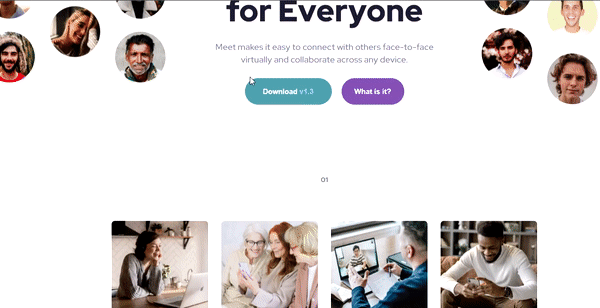

# Welcome! 👋

This is a solution to the challenge [Meet landing page on Frontend Mentor](https://www.frontendmentor.io/challenges/meet-landing-page-rbTDS6OUR).
of a landing page to test my knowledge in `html` and `css`.

---

## Table of contents
- [Overview](#overview)
    - [The challenge](#the-challenge)
    - [Links](#links)
- [My process](#my-process)
    - [Built with](#built-with)
    - [What I learned](#what-i-learned)
    - [Continued development](#continued-development)
- [Author](#author)

## Overview

### The challenge:
Users should be able to:

- View the optimal layout depending on their device's screen size
- See hover states for interactive elements

### Screenshot




### Links

- [solution URL](https://github.com/MarcoFranca/challenge-meet-landing-page)
- [live site URL](https://marcofranca.github.io/challenge-meet-landing-page/)

## My process

### Built with

- Semantic HTML5 markup
- CSS custom properties
- Flexbox
- desktop-first

### What I learned


I reinforced my HTML and CSS knowledge in:  
_**attributes:**_ `role` and `arial-label`

property: `position: relative;` and `display: none;`

---
```html
<div class="left-img" role="img" aria-label="image containing six small, round photos, with faces of 2 women and 4 men">
</div>
```

```css
.left-img{
  background-image: url("../assets/desktop/image-hero-left.png");
  background-size: contain;
  background-repeat: no-repeat;
  position: relative;
  left: -33px;
  top: -45px;
  width: 28%;
  height: 55%;
  min-height: 303px;
}
```

```css
    .right-img {
  display: none;
}
```


### Continued development

I will dedicate myself to future projects using javascript concepts along with html and css which I am studying and improving myself


## Author

- Linkdin - [Marco Tullio Franca](https://www.linkedin.com/in/marco-franca/)
- Frontend Mentor - [@MarcoFranca](https://www.frontendmentor.io/profile/MarcoFranca)


